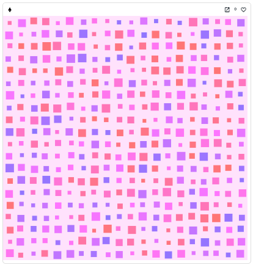
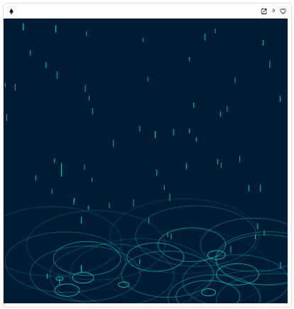
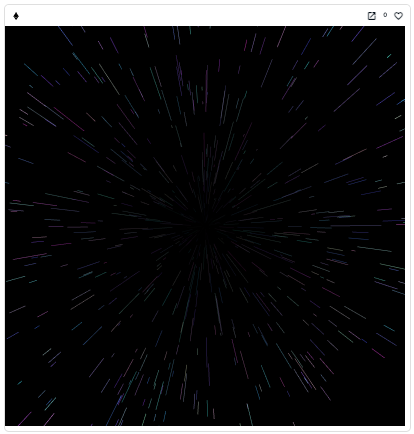
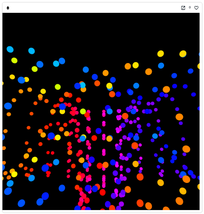
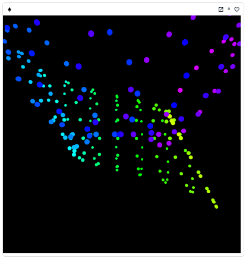
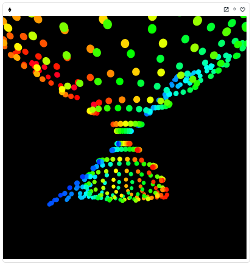

# scripty.sol Examples

Examples of fully on-chain p5.js NFT using [scripty.sol](https://github.com/intartnft/scripty.sol).

## Example1





[OpenSea](https://testnets.opensea.io/ja/assets/goerli/0x85f04037ab31e9af211e777675b7d24cfe4a8172/1)  
[Etherscan](https://goerli.etherscan.io/address/0x85f04037ab31e9af211e777675b7d24cfe4a8172#code)

Sketch files are uploaded to EthFS.

## Example2 (Generative NFT)





[OpenSea](https://testnets.opensea.io/ja/assets/goerli/0xc0aa1dfe5d3548a641f77d288ef857956ad9a4a9/1)  
[Etherscan](https://goerli.etherscan.io/address/0xc0aa1dfe5d3548a641f77d288ef857956ad9a4a9#code)

Sketch file is uploaded to ScriptyStorage.

## Setup

```shell
git clone https://github.com/NowAndNawoo/scripty-sol-examples.git
cd scripty-sol-examples
npm i
cp .env.sample .env
```

## Scripts

- `npx hardhat run scripts/Example1/deploy.ts --network goerli`
  - Deploy Example1 contract
- `npx hardhat run scripts/Example2/deploy.ts --network goerli`
  - Deploy Example2 contract

## Links

- scripty.sol
  - [GitHub](https://github.com/intartnft/scripty.sol)
  - [Documentation](https://int-art.gitbook.io/scripty.sol/)
- EthFS
  - [GitHub](https://github.com/holic/ethfs)
  - [Frontend (goerli)](https://goerli.ethfs.xyz/)
